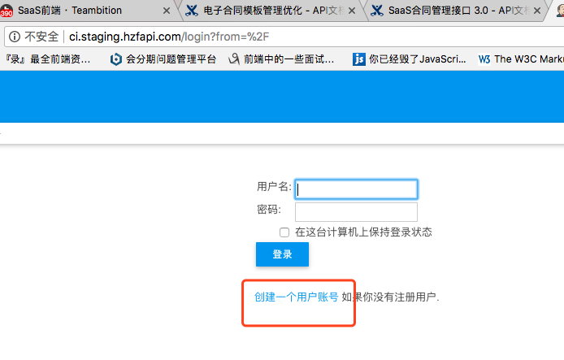
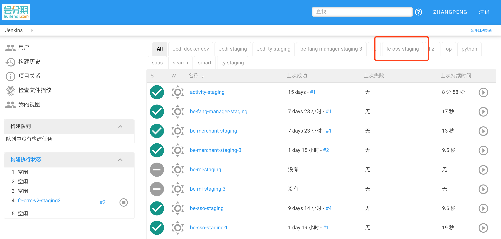
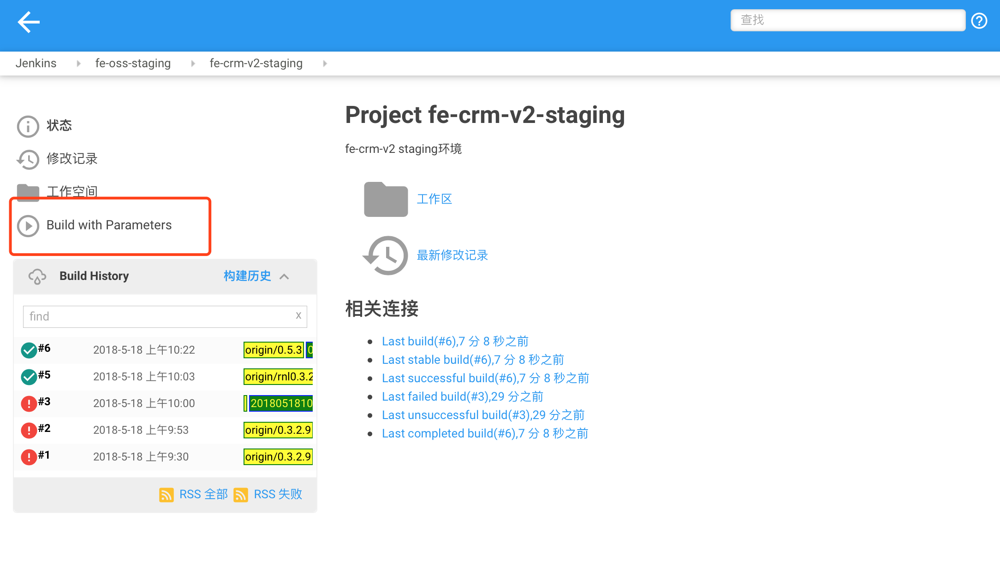
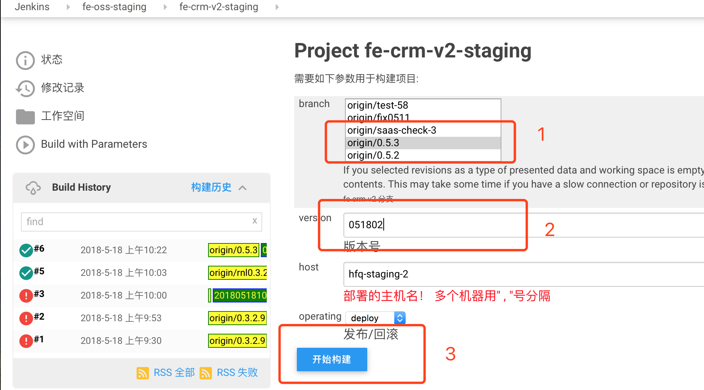

# ci使用手册

## 目前[http://ci.hzfapi.com](http://ci.hzfapi.com)已经迁移至[http://ci.staging.hzfapi.com](http://ci.staging.hzfapi.com)，原ci.hzfapi.com上的job将会逐步停止，后期只会保留生产环境的部署。

## 使用方式

### 登录[http://ci.staging.hzfapi.com](http://ci.staging.hzfapi.com)，首先注册一个新用户。

### 登录之后，切换至fe-oss-staging tab之下。fe-oss-staging为前端项目部署的tab，所有SaaS前端项目的job都在该tab下。

### 选择你所需要部署的job。

### 选择要部署的分支，填写版本信息（版本信息格式为当前时间戳 201805181048），然后点击开始构建。

## 附1

| Job | 对应项目 | 服务器 |
| - | - | - |
| fe-crm-staging2 | 分期 - fe-crm | oss |
| fe-crm-v2-staging2 | SaaS - fe-crm-v2 | 47 |
| fe-crm-v2-staging3 | SaaS -fe-crm-v2 | 58 |
| fe-saas-conglomerate-staging2 | 总公司 - fe-saas-conglomerate | oss |
| fe-saas-day-ci-staging | 每日部署 daily build | -- |
| fe-saas-oss-staging2 | 运营管理系统 - fe-saas-oss | 47 |
| fe-saas-rnl-staging2 | 装修贷 - fe-saas-rnl | oss |
| fe-sales-crm-staging | 销售crm - fe-sales-crm | 47 |
